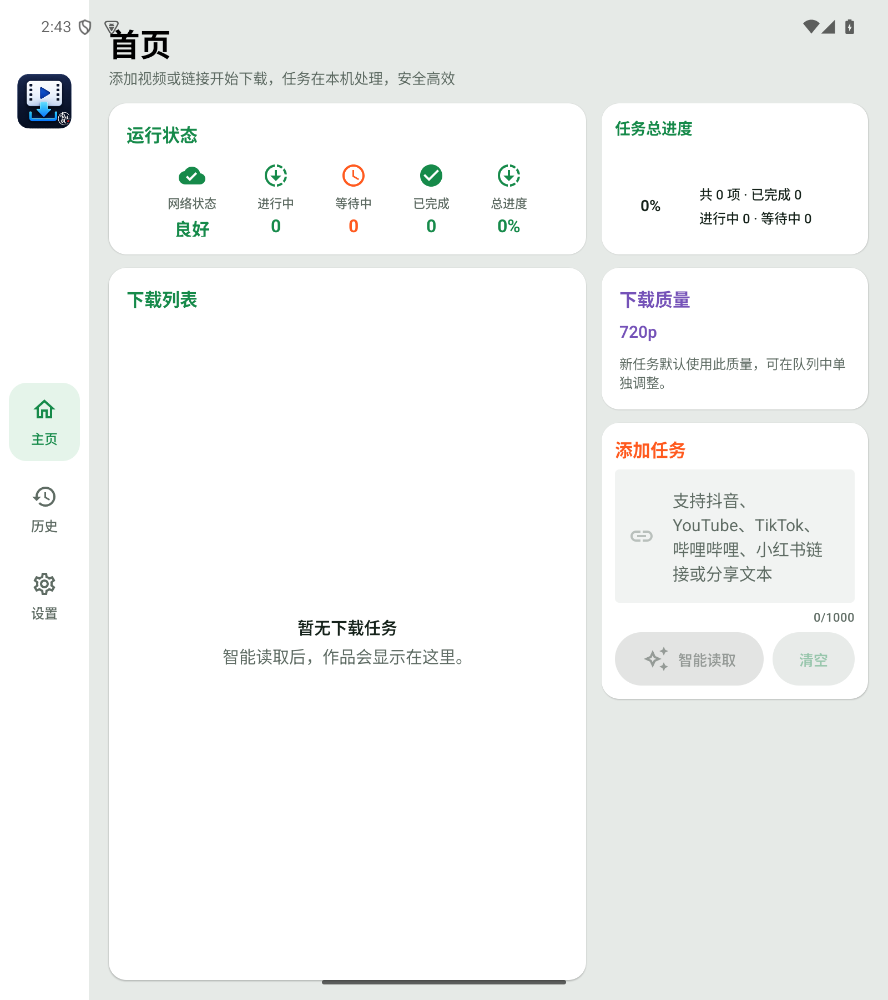
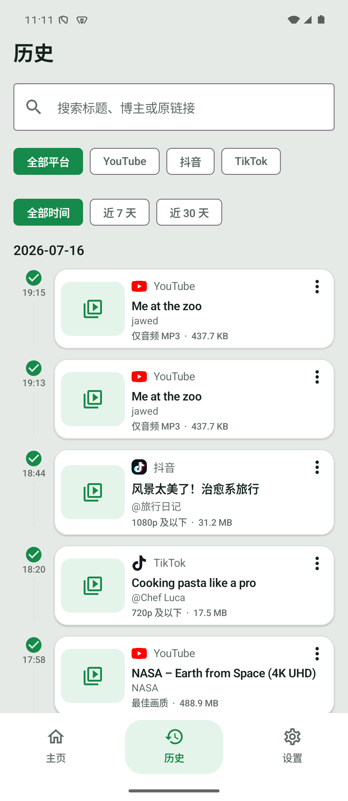
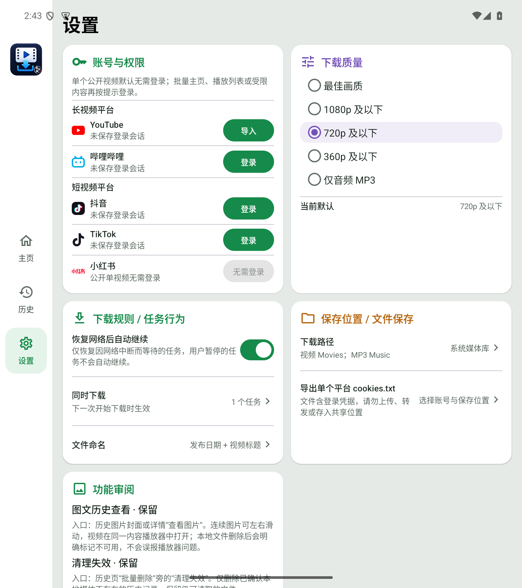

# 南枫下载 Android

面向 Android 的 YouTube、抖音、TikTok、哔哩哔哩和小红书视频下载工作台。支持公开单视频与已结束直播回放的读取、去重、队列管理、真实下载、音视频合并、MP3 转码、系统媒体库发布、完成历史与永久吞吐报告。

> 当前未发布开发版本为 `v1.2.67`（`versionCode 10267`）；最新已发布正式版仍为 `v1.2.48`。历史媒体现支持 App 内视频、图片、动图及小红书实况图查看；小红书实况图保留其动态媒体，抖音 `/note/` 图文从目标作品的完整公开原图 `urlList` 读取，拒绝带平台水印的 `downloadUrlList`，并将该已验证列表直接传给最终下载，禁止后续解析覆盖。折叠屏播放连续性仍以最新 OPPO 用户验证为准。

## 界面预览

| 首页 | 历史 | 设置 |
| --- | --- | --- |
|  |  |  |

截图来自当前最终 APK 在项目专用 Android 模拟器中的真实运行页面，统一使用 OPPO Find N5 外屏基准 `1140×2616 / 442dpi / font scale 1.0`。每张图片只展示一个页面，不使用旧设计稿或多页面拼接图冒充实际界面。

## 下载安装

前往 [v1.2.8 正式版](https://github.com/nanzhufeng/NanfengDownload-Android/releases/tag/v1.2.8) 下载 `NanfengDownload-Android-v1.2.8.apk`。AAB 用于后续应用商店分发，普通安装请选择 APK；校验值见同一 Release 的 `SHA256SUMS.txt`。本地构建仍按约定输出中文名，GitHub Release 因平台会清洗非 ASCII 附件名而使用英文文件名。

正式版使用长期 Release 签名。项目曾通过 Android v3 签名证书谱系，将指定 OPPO 上的 `0.1.0-probe` Debug 验收版无损迁移到正式签名；其他设备若签名不一致，仍必须停止并先确认迁移或备份方案，不得自动卸载或清除数据。

## 核心能力

- 支持粘贴或分享 YouTube、抖音、TikTok、哔哩哔哩和小红书链接，公开单视频优先无需登录使用。
- 下载列表持久保留等待、下载、失败、取消与重复跳过状态；失败提供中文原因、解决建议、重试和删除。
- 平台感知的 Range 探测与单/多连接传输，保存实际连接模式、网络字节、平均/峰值速度、重试和回退原因。
- 支持最佳画质、1080p、720p、360p 与仅音频 MP3；没有独立音频流时，自动选取最高不超过 720p 的含音轨视频作为转换源，真实 MP3 由 Android 解码 PCM 后通过 LAME 4.0 编码。
- YouTube 独立音频使用单连接顺序 Range，避免多个音频分片在 CDN 上互相争抢带宽；视频及视频转音频源仍使用平台感知的多连接策略。
- 视频写入系统 `Movies`，MP3 写入系统 `Music`；历史音频点击左侧封面直接使用 App 内置播放器，外部播放器保留为次要操作。
- 账号与权限页把授权能力明确分开：哔哩哔哩使用应用内官方 H5 登录并通过真实请求验证会话；YouTube 只导入合法会话文件；抖音、TikTok 与小红书只走公开内容模式，下载请求不会携带 WebView 登录信息。
- 适配 OPPO Find N5：外屏单页底部导航，内屏单页左侧导航与双栏工作区。

## 产品边界

- 只处理公开内容，以及用户已合法登录并有权访问的内容。
- 不绕过会员、付费、DRM 或私密内容限制。
- 哔哩哔哩当前只支持单视频，不声明支持尚未跑通的 UP 主页批量读取；小红书支持公开视频笔记与公开图文/实况图笔记。
- 不在仓库中保存账号密码、Cookie、Token、签名密钥或用户媒体。
- 平台 CDN、网络、地区和账号条件会影响速度与成功率，界面只报告真实测量结果。

## 技术栈

- Kotlin、Jetpack Compose、Material 3、Navigation Compose
- Room、DataStore、WorkManager、OkHttp、Media3
- Chaquopy Python 3.13 + `yt-dlp`
- Android NDK/CMake + LAME 4.0 JNI
- `minSdk 29`、`compileSdk 35`、`targetSdk 35`

完整版本与架构见 [context.md](context.md)。

## 构建与验证

正式打包必须通过环境变量提供 `NANFENG_RELEASE_STORE_FILE`、`NANFENG_RELEASE_STORE_PASSWORD`、`NANFENG_RELEASE_KEY_ALIAS` 和 `NANFENG_RELEASE_KEY_PASSWORD`；签名密钥与密码不会保存在仓库中。

```bash
cd android
JAVA_HOME="/Applications/Android Studio.app/Contents/jbr/Contents/Home" \
NANZHUFENG_BUILD_PYTHON="/opt/homebrew/bin/python3.13" \
./gradlew :app:testDebugUnitTest :app:testReleaseUnitTest :app:lintRelease \
  :app:stageFormalReleaseArtifacts --max-workers=1
```

构建产物直接命名为：

```text
android/app/build/outputs/formal-release/南枫下载-Android-v1.2.8.apk
android/app/build/outputs/formal-release/南枫下载-Android-v1.2.8.aab
```

自动化 UI 测试必须绑定项目专用模拟器。OPPO 真机更新固定使用“推送 APK → `pm install -r --user 0`”的同签名覆盖路径，不使用会触发 ColorOS 图形确认页的直接 `adb install`。

## 项目文档

- [context.md](context.md)：当前技术栈、目录结构、数据流、构建与风险入口。
- [PROJECT_HANDOFF.md](PROJECT_HANDOFF.md)：真实设备、三平台下载、吞吐报告和阶段验收证据。
- [design-qa.md](design-qa.md)：外屏/内屏三页 UI 合同与视觉验收。

## 发布状态

当前仓库明确维护 Android 版。`v1.2.8` 使用既有正式证书生成 APK/AAB，并在 OPPO 完成同签名无损覆盖、数据保留、抖音原问题短链接真实读取与下载；成品已进入 MediaStore 和历史记录。Google Play 上架和签名密钥异地加密备份仍是后续独立任务。
